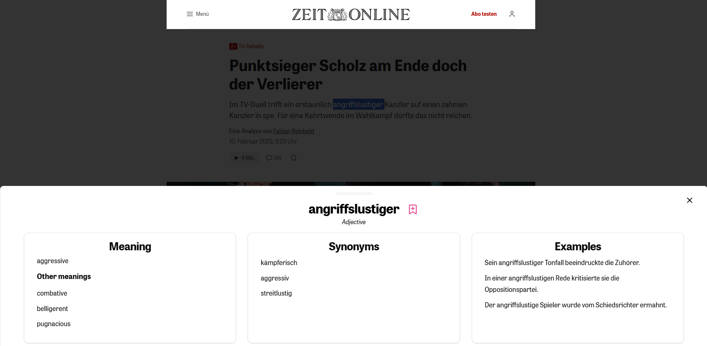

# AI-Powered Chrome Extension for Context-Informed Translations

## 🚀 Overview
This Chrome extension leverages AI to provide context-informed translations. It enhances language learning and comprehension by offering:

- 📖 **Context-aware translations** for words.
- 🔍 **Synonyms and example sentences** to deepen understanding.
- 📚 **Personal dictionary** where users can save words for later reference.

## 📦 Installation
To run the project locally, follow these steps:

### Backend Setup
```sh
cd server
npm i
nodemon
```

### Frontend Setup
```sh
cd client
npm i
npm run dev
```

## 🎯 Usage
1. Install the Chrome extension.
2. Highlight a word or phrase on any webpage.
3. View translations, synonyms, and contextual examples.
4. Save words to your dictionary for future reference.


## 🛠 Technologies Used
- **Express.js** for backend and APIs
- **React.js, Vite, shadcn/ui** for frontend
- **Chrome Extension API** for browser integration
- **OpenAI API** for intelligent translations

## 🤝 Contributing
Feel free to fork this repository and submit pull requests! Any suggestions or feature requests are welcome. 

## 📜 License
This project is licensed under the MIT License.

---
Enjoy seamless, intelligent translations while browsing the web! 🌍✨
